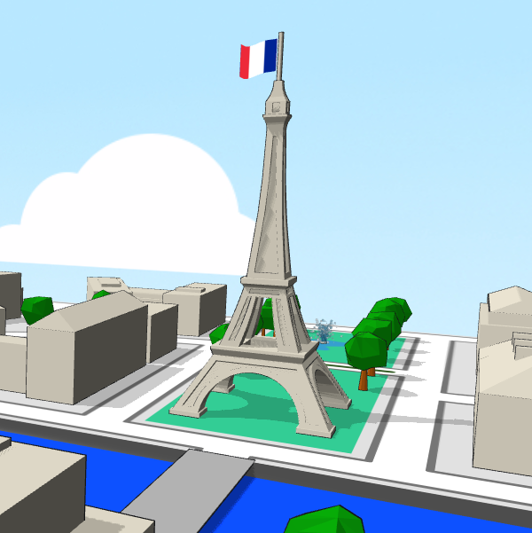
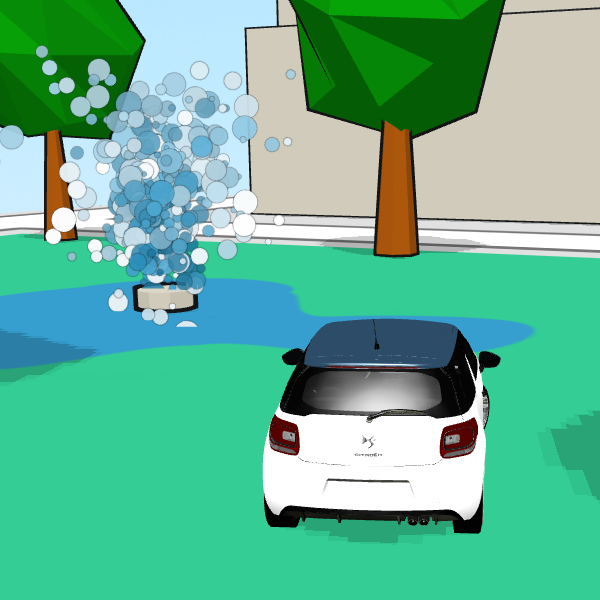
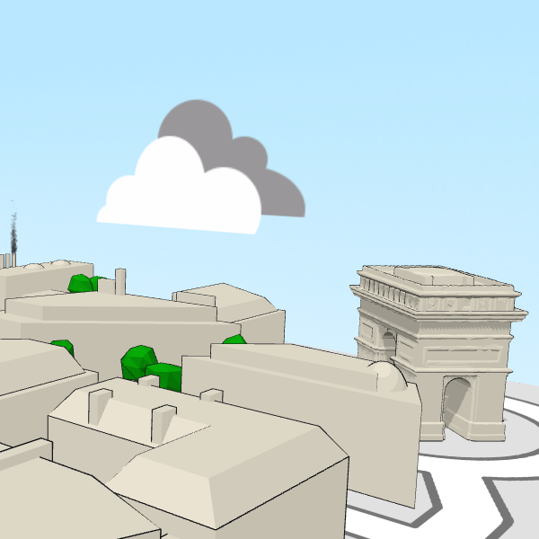

DiStraction
===========

A babylon.js driving game demo written in 2014 with some resources available at that time.

The demo is still playable here: https://www.babylonjs.com/Demos/Distraction/

Check the Github action "Make dist" to get an artifact that contains the full autonomous demo code (minified). 

Since 2014, some websites mentioned in the first html page have vanished:
- http://www.cannonjs.org/
- http://www.references3d.com

## 2014 personal code tips

### Shadows by buildings on themselves

The effect is achieved with 2 combined methods to avoid issues:
- In ground.js file, we ensure that shadows are made by a copy of the buildings reduced by a 0.98 ratio
> if (ground.shadowGenerator !== null) { ground._setShadowImpostor(meshWithShadowsList); }
>
> impostor = this._copyMesh(meshList[i], "copy", new BABYLON.Vector3(0.98, 0.98, 0.98));

- In "cellShading.fragment.fx", we use the "Poisson" effect with 0.00002 bias.

Furthermore, in the"cellShading.fragment.fx" shader, we avoid shadows on surfaces that have their back towards the light thanks to the scalar product test:
> if(dp > 0.0) gl_FragColor *= shadow;

## Blender

Tips to make cel-shading highlight work with buildings:
- Gravity center must be inside the volume. The simplest way is to do "set origin" and then "origin to center of mass".
- Regarding volumes that are not rectangular parallelepipeds, "scale" ratio must be the same on x, y, and z axis (if not, it seems for an unknown reason that normals are wrong, and back faces are not displayed at the proper time).

